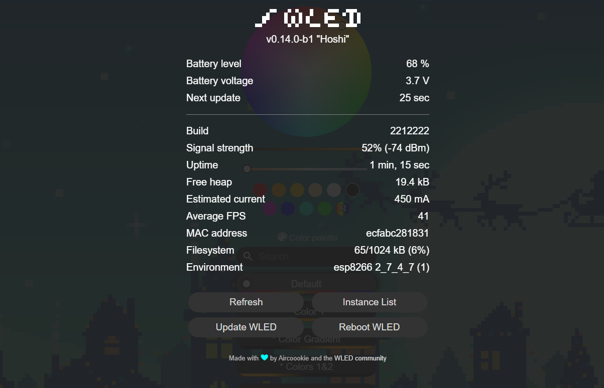
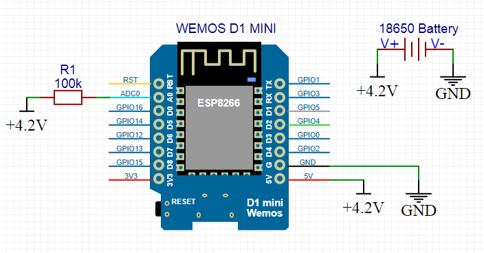
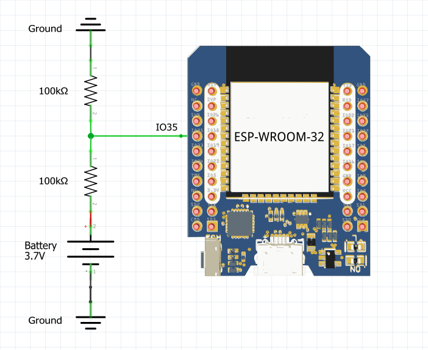

<p align="center">
  
</p>

# Welcome to the battery usermod! 🔋

Enables battery level monitoring of your project.

<p align="left">
  
</p>

<br>

## ⚙️ Features

- 💯 Displays current battery voltage
- 🚥 Displays battery level
- 🔌 Charging state detection (voltage trend based)
- ⏱️ Estimated runtime remaining (requires INA226 current sensor)
- 🚫 Auto-off with configurable threshold
- 🚨 Low power indicator with many configuration possibilities

<br><br>

## 🎈 Installation

In `platformio_override.ini` (or `platformio.ini`)<br>Under: `custom_usermods =`, add the line: `Battery`<br><br>[Example: platformio_override.ini](assets/installation_platformio_override_ini.png) |

<br><br>

## 🔌 Example wiring

- (see [Useful Links](#useful-links)).

<table style="width: 100%; table-layout: fixed;">
<tr>
  <!-- Column for the first image -->
  <td style="width: 50%; vertical-align: bottom;">
    
    <p><strong>ESP8266</strong><br>
      With a 100k Ohm resistor, connect the positive<br>
      side of the battery to pin `A0`.</p>
  </td>
  <!-- Column for the second image -->
  <td style="width: 50%; vertical-align: bottom;">
    
    <p><strong>ESP32</strong> (+S2, S3, C3 etc...)<br>
      Use a voltage divider (two resistors of equal value).<br>
      Connect to ADC1 (GPIO32 - GPIO39). GPIO35 is Default.</p>
  </td>
</tr>
</table>

<br><br>

## Define Your Options

| Name                                            | Unit        | Description                                                                           |
| ----------------------------------------------- | ----------- |-------------------------------------------------------------------------------------- |
| `USERMOD_BATTERY`                               |             | Define this (in `my_config.h`) to have this usermod included wled00\usermods_list.cpp |
| `USERMOD_BATTERY_MEASUREMENT_PIN`               |             | Defaults to A0 on ESP8266 and GPIO35 on ESP32                                         |
| `USERMOD_BATTERY_MEASUREMENT_INTERVAL`          | ms          | Battery check interval. defaults to 30 seconds                                        |
| `USERMOD_BATTERY_INITIAL_DELAY`                 | ms          | Delay before initial reading. defaults to 10 seconds to allow voltage stabilization   |
| `USERMOD_BATTERY_{TYPE}_MIN_VOLTAGE`            | v           | Minimum battery voltage. default is 2.6 (18650 battery standard)                      |
| `USERMOD_BATTERY_{TYPE}_MAX_VOLTAGE`            | v           | Maximum battery voltage. default is 4.2 (18650 battery standard)                      |
| `USERMOD_BATTERY_{TYPE}_TOTAL_CAPACITY`         | mAh         | The capacity of all cells in parallel summed up                                       |
| `USERMOD_BATTERY_{TYPE}_CALIBRATION`            |             | Offset / calibration number, fine tune the measured voltage by the microcontroller    |
| Auto-Off                                        | ---         | ---                                                                                   |
| `USERMOD_BATTERY_AUTO_OFF_ENABLED`              | true/false  | Enables auto-off                                                                      |
| `USERMOD_BATTERY_AUTO_OFF_THRESHOLD`            | % (0-100)   | When this threshold is reached master power turns off                                 |
| Estimated Runtime                               | ---         | ---                                                                                   |
| `USERMOD_BATTERY_CAPACITY`                      | mAh         | Total battery capacity for runtime calculation. defaults to 3000                      |
| Low-Power-Indicator                             | ---         | ---                                                                                   |
| `USERMOD_BATTERY_LOW_POWER_INDICATOR_ENABLED`   | true/false  | Enables low power indication                                                          |
| `USERMOD_BATTERY_LOW_POWER_INDICATOR_PRESET`    | preset id   | When low power is detected then use this preset to indicate low power                 |
| `USERMOD_BATTERY_LOW_POWER_INDICATOR_THRESHOLD` | % (0-100)   | When this threshold is reached low power gets indicated                               |
| `USERMOD_BATTERY_LOW_POWER_INDICATOR_DURATION`  | seconds     | For this long the configured preset is played                                         |

All parameters can be configured at runtime via the Usermods settings page.

<br>

**NOTICE:** Each Battery type can be pre-configured individualy (in `my_config.h`)

| Name                    | Alias           | `my_config.h` example                    |
| ----------------------- | --------------- | ---------------------------------------- |
| Lithium Polymer         | lipo (Li-Po)    | `USERMOD_BATTERY_LIPO_MIN_VOLTAGE`       |
| Lithium Ion             | lion (Li-Ion)   | `USERMOD_BATTERY_LION_MIN_VOLTAGE`       |
| Lithium Iron Phosphate  | lifepo4 (LFP)  | `USERMOD_BATTERY_LIFEPO4_MIN_VOLTAGE`    |

<br><br>

## 🔋 Adding a Custom Battery Type

If none of the built-in battery types match your cell chemistry, you can add your own.

### Step-by-step

1. **Create a new header** in `usermods/Battery/types/`, e.g. `MyBattery.h`.
   Use an existing type as a template (e.g. `LipoUMBattery.h`):

   ```cpp
   #ifndef UMBMyBattery_h
   #define UMBMyBattery_h

   #include "../battery_defaults.h"
   #include "../UMBattery.h"

   class MyBattery : public UMBattery
   {
       private:
           static const LutEntry dischargeLut[] PROGMEM;
           static const uint8_t dischargeLutSize;

       public:
           MyBattery() : UMBattery()
           {
               // Set your cell's voltage limits
               this->setMinVoltage(3.0f);
               this->setMaxVoltage(4.2f);
           }

           float mapVoltage(float v) override
           {
               return this->lutInterpolate(v, dischargeLut, dischargeLutSize);
           };

           // Optional: override setMaxVoltage to enforce a minimum gap
           // void setMaxVoltage(float voltage) override
           // {
           //     this->maxVoltage = max(getMinVoltage()+0.5f, voltage);
           // }
   };

   // Discharge lookup table – voltage (descending) → percentage
   // Obtain this data from your cell's datasheet
   // Note: these definitions live in the header because Battery.cpp is the only
   // translation unit that includes battery-type headers (same pattern as the
   // built-in types). Do not include this header from other .cpp files.
   const UMBattery::LutEntry MyBattery::dischargeLut[] PROGMEM = {
       {4.20f, 100.0f},
       {3.90f,  75.0f},
       {3.60f,  25.0f},
       {3.00f,   0.0f},
   };
   const uint8_t MyBattery::dischargeLutSize =
       sizeof(MyBattery::dischargeLut) / sizeof(MyBattery::dischargeLut[0]);

   #endif
   ```

2. **Add a new enum value** in `battery_defaults.h`:

   ```cpp
   typedef enum
   {
     lipo=1,
     lion=2,
     lifepo4=3,
     mybattery=4    // <-- new
   } batteryType;
   ```

3. **Register defaults** (optional) in `battery_defaults.h`:

   ```cpp
   #ifndef USERMOD_BATTERY_MYBATTERY_MIN_VOLTAGE
     #define USERMOD_BATTERY_MYBATTERY_MIN_VOLTAGE 3.0f
   #endif
   #ifndef USERMOD_BATTERY_MYBATTERY_MAX_VOLTAGE
     #define USERMOD_BATTERY_MYBATTERY_MAX_VOLTAGE 4.2f
   #endif
   ```

4. **Wire it up** in `Battery.cpp`:

   - Add the include at the top:
     ```cpp
     #include "types/MyBattery.h"
     ```
   - Add a case in `createBattery()`:
     ```cpp
     case mybattery: return new MyBattery();
     ```
   - Add a dropdown option in `appendConfigData()`:
     ```cpp
     oappend(F("addOption(td,'My Battery','4');"));
     ```

5. **Compile and flash** — select your new type from the Battery settings page.

<br><br>

## ⏱️ Estimated Runtime

The battery usermod can estimate the remaining runtime of your project. This feature is **automatically enabled** when the [INA226 usermod](../INA226_v2/) is detected at runtime — no additional build flags or compile-time configuration are required beyond adding the INA226 usermod to `custom_usermods` (see [Setup](#setup) below).

### How it works

1. The INA226 current sensor measures the actual current draw of your project
2. **Coulomb counting**: Current is integrated over time (`SoC -= I × dt / capacity`) to track charge consumed, instead of relying solely on voltage. When the battery is at rest (current < 10mA for 60s), the Coulomb counter recalibrates from the voltage-based SoC (OCV is accurate at rest)
3. The current reading is smoothed using an exponential moving average to reduce jitter from load fluctuations (e.g. LED effect changes, WiFi traffic)
4. The estimated time remaining is: `remaining_Ah / smoothed_current_A`

### Setup

Add both usermods to your `platformio_override.ini`:

```ini
custom_usermods = Battery INA226
```

Set your battery capacity in the WLED Usermods settings page or at compile time:

```ini
-D USERMOD_BATTERY_CAPACITY=3000
```

### Accuracy

> **This is an estimation, not a precise measurement.**

The battery usermod combines voltage-based lookup tables with software Coulomb counting. This is the same approach used by many consumer battery management systems. It is suitable for hobby projects and provides a useful estimate, but it is **not a substitute for a dedicated battery fuel gauge IC**.

What the usermod does to improve accuracy:

- **Coulomb counting**: Instead of relying solely on voltage, the usermod integrates current over time to track charge consumed. This is more accurate during discharge than voltage-based estimation alone.
- **Rest recalibration**: When the battery is at rest (current < 10mA for 60 seconds), the Coulomb counter recalibrates from the voltage-based SoC. Open-circuit voltage is accurate at rest, which corrects for Coulomb counting drift.

Remaining limitations:

- **Voltage under load**: SoC is estimated from the battery voltage while your LEDs are drawing current. The voltage drop across the battery's internal resistance makes the initial SoC seed and rest recalibrations more pessimistic than reality. Typical error: 10-15%.
- **Variable loads**: LED effects with changing brightness cause current fluctuations. The smoothing filter takes a few minutes to converge after a load change.
- **LiFePO4 flat curve**: LiFePO4 cells have an extremely flat discharge curve (25% of SoC maps to just ~50mV). Even with Coulomb counting, the initial SoC seed and rest recalibrations are voltage-based. Runtime estimates for LiFePO4 are marked as approximate.
- **Battery aging**: The configured capacity (mAh) does not account for capacity fade over charge cycles.
- **30-second interval**: The measurement interval (default 30s) is relatively coarse for Coulomb counting. Rapid load changes between readings may not be captured.

**Realistic accuracy**: 15-25% error at steady load for LiPo/Li-Ion, 20-40% for variable loads. For LiFePO4, expect 25-50% error in the mid-range.

For hobby LED projects, this level of accuracy is usually sufficient — you'll know roughly how many hours you have left, which is better than no estimate at all.

### For advanced users: dedicated battery fuel gauge ICs

If you need more accurate hardware-based readings, consider using a dedicated battery fuel gauge IC. The [MAX17048 usermod](../MAX17048_v2/) supports one such IC out of the box — no sense resistor required.

Other ICs that use hardware Coulomb counting, temperature compensation, and sophisticated algorithms to achieve 1-3% SoC accuracy:

| IC                 | Interface | Method                          | Notes                                           |
| ------------------ | --------- | ------------------------------- | ----------------------------------------------- |
| **TI INA228**      | I2C       | Voltage/current + charge accum. | INA226 successor with hardware Coulomb counter  |
| **TI BQ27441**     | I2C       | Impedance Track                 | Full fuel gauge with temperature compensation   |
| **Analog LTC2941** | I2C       | Coulomb counting                | Simple, accurate, programmable alerts           |
| **ST STC3117**     | I2C       | OptimGauge (combined approach)  | Coulomb counting with voltage-based corrections |

<br><br>

## 🔧 Calibration

The calibration number is a value that is added to the final computed voltage after it has been scaled by the voltage multiplier. 

It fine-tunes the voltage reading so that it more closely matches the actual battery voltage, compensating for inaccuracies inherent in the voltage divider resistors or the ESP's ADC measurements.

Set calibration either in the Usermods settings page or at compile time in `my_config.h` or `platformio_override.ini`.

It can be either a positive or negative number.

<br><br>

## ⚠️ Important

Make sure you know your battery specifications! All batteries are **NOT** the same!

Example:

| Your battery specification table  |                 | Options you can define        |
| --------------------------------- | --------------- | ----------------------------- |
| Capacity                          | 3500mAh 12.5Wh  |                               |
| Minimum capacity                  | 3350mAh 11.9Wh  |                               |
| Rated voltage                     | 3.6V - 3.7V     |                               |
| **Charging end voltage**          | **4.2V ± 0.05** | `USERMOD_BATTERY_MAX_VOLTAGE` |
| **Discharge voltage**             | **2.5V**        | `USERMOD_BATTERY_MIN_VOLTAGE` |
| Max. discharge current (constant) | 10A (10000mA)   |                               |
| max. charging current             | 1.7A (1700mA)   |                               |
| ...                               | ...             | ...                           |
| ..                                | ..              | ..                            |

Specification from: [Molicel INR18650-M35A, 3500mAh 10A Lithium-ion battery, 3.6V - 3.7V](https://www.akkuteile.de/lithium-ionen-akkus/18650/molicel/molicel-inr18650-m35a-3500mah-10a-lithium-ionen-akku-3-6v-3-7v_100833)

<br><br>

## 🌐 Useful Links

- https://lazyzero.de/elektronik/esp8266/wemos_d1_mini_a0/start
- https://arduinodiy.wordpress.com/2016/12/25/monitoring-lipo-battery-voltage-with-wemos-d1-minibattery-shield-and-thingspeak/

<br><br>

## 📝 Change Log

2026-02-28

- Added `readFromJsonState()` for remote config updates via JSON API
- Added `onMqttMessage()` for remote config updates via MQTT (`<deviceTopic>/battery/set`)
- Both gated behind `USERMOD_BATTERY_ALLOW_REMOTE_UPDATE` compile-time flag
- Added `override` keyword to all overridden methods for compile-time safety
- Added `addToJsonState()` init guard to prevent crash on boot
- Increased MQTT discovery JSON buffer from 600 to 1024 bytes
- Fixed `umLevel` type mismatch (`int8_t`/`UMT_BYTE` → `int16_t`/`UMT_INT16`)
- Fixed auto-off, Coulomb init, and rest recalibration firing on invalid `-1` level
- Used `VOLTAGE_HISTORY_SIZE` constant instead of magic number for array size

2026-02-25

- Added LiFePO4 battery type with piecewise-linear discharge curve
- Added estimated runtime with Coulomb counting (auto-detected via INA226 usermod)
- Added charging detection using sliding window voltage trend
- Added charging status and runtime to MQTT, JSON API, and web UI info panel
- Code cleanup and reorganization

2024-08-19

- Improved MQTT support
- Added battery percentage & battery voltage as MQTT topic

2024-05-11

- Documentation updated

2024-04-30

- Integrate factory pattern to make it easier to add other / custom battery types
- Update readme
- Improved initial reading accuracy by delaying initial measurement to allow voltage to stabilize at power-on

2023-01-04

- Basic support for LiPo rechargeable batteries (`-D USERMOD_BATTERY_USE_LIPO`)
- Improved support for ESP32 (read calibrated voltage)
- Corrected config saving (measurement pin, and battery min/max were lost)
- Various bugfixes

2022-12-25

- Added "auto-off" feature
- Added "low-power-indication" feature
- Added "calibration/offset" field to configuration page
- Added getter and setter, so that user usermods could interact with this one
- Update readme (added new options, made it markdownlint compliant)

2021-09-02

- Added "Battery voltage" to info
- Added circuit diagram to readme
- Added MQTT support, sending battery voltage
- Minor fixes

2021-08-15

- Changed `USERMOD_BATTERY_MIN_VOLTAGE` to 2.6 volt as default for 18650 batteries
- Updated readme, added specification table

2021-08-10

- Created
