# WLED on M5Stack CoreS3

[日本語](readme_jp.md)

This project runs the WLED v17 series natively on M5Stack CoreS3 and combines<br>
**local touch control / built-in microphone Audio Reactive / battery status / safe power-off / LED control** in a single device.

> **Status:** CoreS3 production baseline<br>
> **Base:** WLED 17.0.0-devV5<br>
> **Target:** M5Stack CoreS3 (ESP32-S3 / 16MB Flash / 8MB Quad PSRAM)
>
> This is a community-maintained CoreS3 port/extension of WLED and is not an official WLED or M5Stack firmware release.

---

## Features

- Native WLED runtime on M5Stack CoreS3
- Local control with the 320 × 240 touch display
- Bidirectional synchronization between the WLED Web UI and CoreS3 UI
- LED Brightness / Effect / Speed / Intensity / Palette control
- Independent C1 / C2 / C3 multi-color editing
- Preset Call / SAVE / OVERWRITE / DELETE / BOOT PRESET
- Audio Reactive using the built-in ES7210 dual microphones
- Battery level display
- Display Sleep / Wake
- Wi-Fi Offline / Recovery AP UX
- Safe Shutdown using the AXP2101 Power Key
- LED BLACK frame before hard power-off
- Restore of the previous LED state when Safe Shutdown is canceled
- ESP32-S3 / NeoPixelBus RMT DMA1024 and LCD/GDMA runtime-rebuild stabilization
- Browser capture of the current LCD as a BMP image

---

## Screenshots

The following images were captured directly from the CoreS3 LCD using the Browser Screenshot feature.

### Main

<p align="center">
  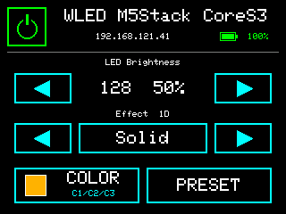
</p>

The MAIN screen provides LED Power, Brightness, Effect, Color, Preset, network status, and battery status.

### Effect

<table>
  <tr>
    <td>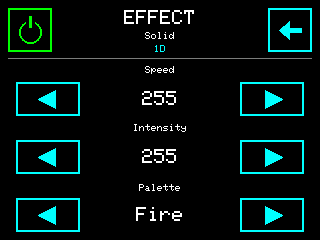</td>
    <td>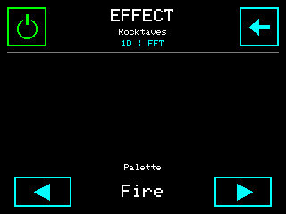</td>
  </tr>
  <tr>
    <td align="center">Standard Effect</td>
    <td align="center">Audio Reactive Effect</td>
  </tr>
</table>

Only parameters that are available for the selected Effect are shown.<br>
Audio Reactive Effects can expose a different parameter set from standard Effects, and the UI follows that dynamically.

### Color

<table>
  <tr>
    <td>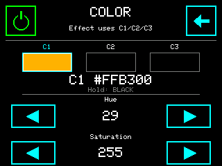</td>
    <td>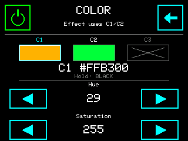</td>
    <td>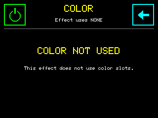</td>
  </tr>
  <tr>
    <td align="center">C1 Edit</td>
    <td align="center">C1 / C2</td>
    <td align="center">Color Not Used</td>
  </tr>
</table>

C1 / C2 / C3 can be selected and edited independently.<br>
When the current Effect does not use a Color Slot, the UI shows `COLOR NOT USED`.

### Preset

<table>
  <tr>
    <td>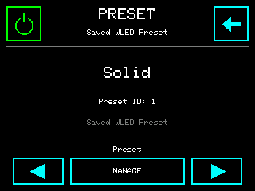</td>
    <td>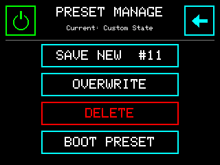</td>
    <td>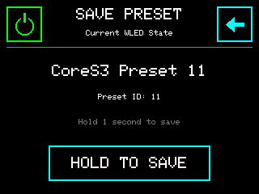</td>
  </tr>
  <tr>
    <td align="center">Preset</td>
    <td align="center">Preset Manage</td>
    <td align="center">Save New</td>
  </tr>
  <tr>
    <td>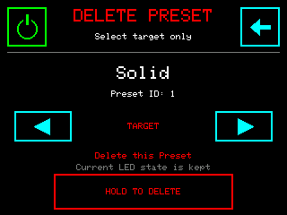</td>
    <td>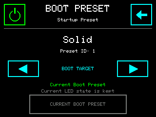</td>
    <td></td>
  </tr>
  <tr>
    <td align="center">Delete Preset</td>
    <td align="center">Boot Preset</td>
    <td></td>
  </tr>
</table>

In addition to recalling Presets, CoreS3 can perform SAVE NEW / OVERWRITE / DELETE / BOOT PRESET operations.

### Browser Screenshot

The current CoreS3 LCD can be captured from a browser at:

```text
http://<CoreS3-IP>/cores3/screenshot.bmp
```

Example:

```text
http://192.168.1.100/cores3/screenshot.bmp
```

The endpoint returns a still image.<br>
Refreshing the URL captures the current 320 × 240 LCD contents again.

The LCD is read as RGB565 and converted to a 24-bit BMP.<br>
Large screenshot buffers are not kept resident during normal operation; they are allocated in PSRAM only while a request is active.

The PNG images included in this documentation were also created by converting BMP files captured with this Browser Screenshot endpoint on the PC side.

---

## Tested Hardware

### Controller

- M5Stack CoreS3
- ESP32-S3 240 MHz
- 16 MB Flash
- 8 MB Quad PSRAM
- AXP2101 PMIC
- ES7210 audio codec / built-in microphones
- 320 × 240 touch display

### LED

Hardware validation used the M5Stack DIGITAL RGB LED STRIP.

- SK6812
- RGB type
- 60 LEDs / m
- Two strips connected, for 120 physical LEDs
- WLED Bus Type: `WS281x`
- Color Order: `GRB`
- CoreS3 Port.C
- GPIO17

> **Important:** This project does not guarantee the safety of directly powering 120 LEDs at high brightness from the CoreS3.<br>
> For larger LED counts or higher brightness, use an appropriately sized external 5V LED power supply with a common GND.

---

## Recommended Brightness

The standard WLED default Brightness is not modified.

When powering an LED Strip directly from CoreS3, hardware testing showed that the battery level can decrease even while USB-C power is connected at Brightness 128.

For this reason, **a starting Brightness around 64** is recommended for the CoreS3 test configuration.

```text
WLED default:           128
CoreS3 recommendation:  64
```

This does not modify the WLED core default.<br>
Actual power consumption depends heavily on LED count, colors, Effect, and the external power architecture.

---

## Build Environment

Validated build environment:

```text
WLED                  17.0.0-devV5
PlatformIO env        m5stack_cores3
Platform              pioarduino / platform-espressif32 55.03.39
Arduino Core           3.3.9
ESP-IDF libraries      5.5.4
NeoPixelBus            2.9.0+sha.76afe83
```

The CoreS3 environment is defined in `platformio_override.ini`.

Key settings:

```ini
[platformio]
default_envs = m5stack_cores3

[env:m5stack_cores3]
extends = env:esp32s3dev_16MB_opi

board_build.arduino.memory_type = qio_qspi
board_build.flash_mode = qio
```

CoreS3-specific usermods:

```text
CoreS3_Power
CoreS3_Display
CoreS3_Audio
audioreactive
```

Audio Reactive definitions:

```text
WLED_M5STACK_CORES3_AUDIO=1
UM_AUDIOREACTIVE_ENABLE
SR_DMTYPE=7
```

GPIO0 is used for the ES7210 MCLK and is therefore excluded from the WLED physical Button configuration.

---


### Public Build Example

A ready-to-use CoreS3 PlatformIO override example is included at:

```text
usermods/CoreS3_Display/platformio_override.ini.sample
```

Copy it to the WLED repository root and rename it to:

```text
platformio_override.ini
```

The example includes the CoreS3 environment, Quad PSRAM settings, CoreS3 usermods, Audio Reactive definitions, and the NeoPixelBus patch pre-script.

## Build

### 1. Requirements

- Visual Studio Code
- PlatformIO IDE
- Git
- USB-C cable

### 2. Open the WLED source tree

Open the WLED repository in VS Code.

Confirm that `platformio_override.ini` exists at the repository root. If it does not, copy `usermods/CoreS3_Display/platformio_override.ini.sample` to the repository root and rename it to `platformio_override.ini`.

### 3. Build

Build the following PlatformIO environment:

```text
m5stack_cores3
```

A successful build ends with:

```text
Environment     Status
--------------  -------
m5stack_cores3  SUCCESS
```

### 4. Upload

Upload the `m5stack_cores3` environment from PlatformIO.

If M5Burner Serial Monitor or another program is holding the COM port open, close it before Upload.


---

## NeoPixelBus / RMT DMA1024 + LCD/GDMA Patches

With ESP32-S3 + NeoPixelBus RMT output, hardware testing found an intermittent condition where pixels beyond the configured LED Count could light unexpectedly.

The CoreS3 build applies the following stabilization:

```text
RMT DMA             enabled
mem_block_symbols   1024
```

The patch does not rely on manually editing files under `.pio/libdeps`.

```text
pio-scripts/cores3_v17_neopixelbus_patch.py
```

runs as a PlatformIO pre-script and automatically applies the DMA1024 patch even after NeoPixelBus is downloaded again.

Example when the patch is applied:

```text
[CoreS3 RMT DMA1024] applied ESP32-S3 DMA / 1024-symbol patch: ...
```

When already present:

```text
[CoreS3 RMT DMA1024] patch already present: NeoEsp32RmtXMethod.h
```

The same pre-script also applies the validated LCD/GDMA teardown fix used during runtime LED-bus rebuilds.<br>
When the last LCD mux bus is destroyed, the GDMA channel is stopped, reset, disconnected, and deleted so stale LCD peripheral ownership is not carried into the next bus initialization.

Example when the LCD/GDMA patch is applied:

```text
[CoreS3 LCD GDMA] applied full GDMA teardown production patch: ...
```

When already present:

```text
[CoreS3 LCD GDMA] patch already present: NeoEsp32LcdXMethod.h
```

Both patches are idempotent. Their reproducibility has been validated by deleting the NeoPixelBus dependency and rebuilding from a clean dependency state.

---

## Power Management

### DCDC3 Always-PWM

During investigation of unexpected complete CoreS3 power-offs, DCDC OVP was observed multiple times in the AXP2101 `PWROFF_STATUS`.

The CoreS3 Power usermod uses DCDC3 Always-PWM as a stabilization measure.

```text
DCDC1: AUTO
DCDC3: ALWAYS_PWM
OVP protection: unchanged / enabled
```

Long-duration hardware testing and regression checks showed strong stabilization with this setting.

> This does not claim that DCDC3 itself was proven to be the sole hardware root cause.<br>
> In this project, DCDC3 Always-PWM is treated as a stabilization measure that has been strongly validated on real hardware.

### Safe Shutdown

Holding the physical CoreS3 Power Key sends a BLACK frame to the LED Strip before the PMIC hard power-off.

Processing sequence:

```text
Power Key long press
        ↓
LED BLACK frame
        ↓
Strip suspend
        ↓
AXP2101 hard power-off
```

If the Power Key is released after BLACK but before the final hard power-off, shutdown is canceled and the previous LED output and Brightness are restored.

---

## Audio Reactive

The built-in ES7210 and CoreS3 microphones are used.

The Audio usermod initializes ES7210, while Audio Reactive owns I2S1 / PCM / FFT processing.

Main settings:

```text
Codec          ES7210
I2S            I2S1
Sample Rate    16000 Hz
Format         Stereo / 16-bit
MCLK           GPIO0
DIN            GPIO14
```

Codec initialization is deferred slightly during startup and retried multiple times if necessary.

Audio status can be checked from WLED Info.

---

## Touch UI

Main screens:

```text
MAIN
COLOR
EFFECT
PRESET
PRESET MANAGE
```

CoreS3 and the WLED Web UI synchronize in both directions.

- Change on CoreS3 → reflected in Web UI
- Change in Web UI → reflected on CoreS3

Short press / long press / drag touch operations are supported.

---

## Preset Management

The following operations are available from CoreS3:

```text
Preset Call
SAVE NEW
OVERWRITE
DELETE
BOOT PRESET
```

A Preset cache is used to synchronize with Presets stored by WLED.

---

## Network Recovery

If Wi-Fi connectivity is lost, Recovery AP can be started from the CoreS3 Display.

When Recovery AP is active, access:

```text
http://4.3.2.1
```

The normal WLED Web UI and CoreS3 local controls can be used together.

---

## Battery Status

Battery level is read from the CoreS3 AXP2101 fuel gauge and displayed on the MAIN screen.

Battery status is updated periodically instead of continuously polling I2C.

---

## Project Structure

The main CoreS3-specific files are:

```text
WLED/
├─ platformio_override.ini
├─ pio-scripts/
│  └─ cores3_v17_neopixelbus_patch.py
└─ usermods/
   ├─ CoreS3_Power/
   ├─ CoreS3_Display/
   ├─ CoreS3_Audio/
   └─ audioreactive/
```

### CoreS3_Power

Responsibilities:

- AXP2101
- AW9523B
- External 5V
- DCDC3 Always-PWM
- Power Key
- Safe Shutdown
- Power Health

### CoreS3_Display

Responsibilities:

- M5GFX
- Touch
- Local UI
- Battery display
- Wi-Fi status
- Preset UI
- Browser Screenshot

### CoreS3_Audio

Responsibilities:

- ES7210 probe / initialization
- Audio pins
- Audio health
- Audio Reactive handoff

### audioreactive

Adds CoreS3 built-in microphone / I2S1 integration.

---

## Design Policy

This project intentionally minimizes changes to the WLED core.

CoreS3-specific logic is primarily contained in:

```text
usermods/
pio-scripts/
platformio_override.ini
```

This makes future synchronization with WLED upstream easier.

---

## Current Limitations / Notes

- Segment management is intentionally not implemented in the local UI.<br>
  Use the WLED Web UI for Segment configuration.
- Directly powering 120 LEDs from CoreS3 at high brightness is not recommended.
- The standard WLED Brightness default of 128 is not modified.
- A starting Brightness around 64 is recommended for CoreS3.
- Browser Screenshot returns a still BMP image; it is not a live stream.
- DCDC OVP protection is not disabled.
- Core2 / Core2 for AWS porting is planned as a separate phase after the CoreS3 version is complete.

---

## Validation Summary

The following items have been validated on CoreS3 hardware:

- Normal Boot
- Reset Reboot
- LED ON / OFF
- Effect control
- Multi-Color
- BLACK Toggle
- Preset call / management
- CoreS3 ↔ Web UI sync
- Sleep / Wake
- Wi-Fi reconnect
- Recovery AP
- Audio Reactive
- Battery display
- Runtime Health
- Safe Shutdown cancel
- Safe Shutdown full power-off
- Reboot after shutdown
- Active-use endurance
- Idle endurance
- RMT tail-pixel regression
- NeoPixelBus clean dependency re-patch
- Browser Screenshot
- Screenshot color accuracy
- Screenshot + normal Touch/UI operation

---

## Upstream

This project is based on WLED:

https://github.com/wled/WLED

WLED itself remains the upstream project.<br>
Please refer to the upstream repository for WLED documentation, supported LED types, API behavior, and licensing.

---

## Licensing

WLED source in this repository follows the upstream **EUPL v1.2** license.<br>
NeoPixelBus remains licensed under **LGPL-3.0-or-later**. The CoreS3 build-time patch script modifies the PlatformIO-downloaded NeoPixelBus source while preserving the upstream library license header.

Refer to the repository `LICENSE` file and the respective upstream projects for complete license terms.

---

## Roadmap

Remaining work toward CoreS3 v1.0:

- [x] Power stabilization
- [x] Display / Touch UI
- [x] Audio Reactive
- [x] Preset management
- [x] Battery / Health UX
- [x] Recovery AP
- [x] Safe Shutdown
- [x] NeoPixelBus RMT DMA1024 / LCD-GDMA stabilization
- [x] Browser Screenshot
- [ ] Final release branch / tag
- [ ] Release notes
- [ ] Optional additional screenshots
- [ ] Core2 / Core2 for AWS porting

---

## Acknowledgements

- WLED project and contributors
- M5Stack
- NeoPixelBus
- Audio Reactive / WLED usermod contributors

This project builds on the work of many open-source projects and contributors.
