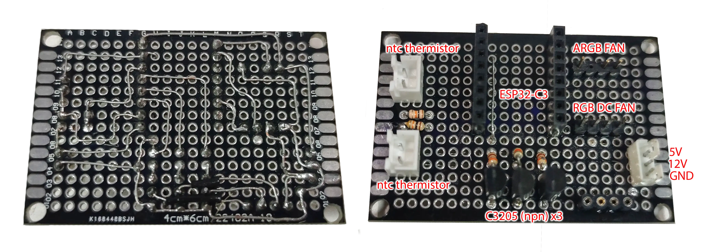

# Koba EGPU

The mod does not make significant changes to the WLED system, but only supplements it with an additional, optional mod. If we describe the mod most compactly, then it is intended for a self-made eGPU station. The system controls the backlight of the case cooling cooler (ARGB) and the backlight of the power supply (RGB). The main task of the system is to control the rotation speed of the cooling cooler, based on an NTC thermistor mounted on the radiator of the video card. The second NTC resistor is designed to assess the temperature of the air next to the cooling cooler before it leaves the box.

## Description

At the end of 2024, I upgraded my laptop, which lacked a high-performance graphics card, but it was compact and convenient. Sometimes my tasks require a video accelerator and parallel computing, and sometimes I also want to play. Therefore, I decided to study eGPU adapters. I purchased a TH3P4, a power supply with an LLC converter (no squeak during operation and high efficiency), as well as an NVIDIA RTX 3070 graphics card. I checked the bundle, everything was fine, but for beauty I didn't have enough housing for the system. I decided to make a case with my father out of plexiglass and aluminum, as he had done it many times in his life. We had a great time together, we made it, but in order for everything to work properly, we needed a microcontroller (to control the rotation speed of the cooler cooling box). And since I'm adding a microcontroller, it would be nice to make my design a little more beautiful by adding lights and the ability to control it through a smart HomeAssistant. The Wled firmware was the best option for my task. I explored the possibilities of using mods, looked at examples, and made my own implementation. I have seen other implementations of mods with cooler rotation speed control, however, their code and implementations, in my opinion, were quite simple. That's why I wrote my own mod, which in my opinion is better made and tested. The only bug that exists now is an incorrect determination of the speed of rotation of the cooler by the tachometer. I don't know why, but while I was testing the board, everything worked well, but when I installed it in the case, added some of the changes, it stopped showing the correct values. But to be honest, I no longer needed the rotation speed value after debugging. I think the problem is related to the features of the ESP32-C3, since it doesn't work out to calculate revolutions beautifully. The microcontroller does not have an impulse counter module. Maybe this mod will be useful to someone, so I tried to document and describe it better, as well as show my board.


### The appearance of the connection layout board on both sides.

The right fragment is reflected horizontally.

The resistors next to the thermistors must have the same nominal value. The resistors in the transistor circuits are probably 1k, I don't remember exactly. The transistors themselves and the corresponding resistors may have been chosen suboptimally by me, but I did it in a hurry and from what I had at hand. Your implementation may be different.

### Platformio configuration for using the mod.
You can add this fragment to platformio_override.ini and restart platformio in the development environment so that the configuration becomes available for use.

```ini
[env:esp32c3_ar_egpu]
extends = env:esp32c3dev
board = esp32-c3-mini
upload_speed = 1000000
monitor_filters = esp32_exception_decoder
build_flags = ${env:esp32c3dev.build_flags} ${esp32.AR_build_flags}
              -D USERMOD_AUDIOREACTIVE
              -D WLED_DISABLE_ALEXA
              -D WLED_DISABLE_ADALIGHT
              -D WLED_DISABLE_LOXONE
              -D WLED_DISABLE_HUESYNC
              -D WLED_DISABLE_INFRARED
              -D WLED_NTP_ENABLED=true
              -DARDUINO_USB_CDC_ON_BOOT=1
              -DARDUINO_USB_MODE=1
              -D DATA_PINS=7,3,2
              -D LED_TYPES=TYPE_ANALOG_3CH
              -D PIXEL_COUNTS=10
              -D BTNPIN=-1,-1
              -D BTNTYPE=BTN_TYPE_PUSH,BTN_TYPE_NONE
              -D ABL_MILLIAMPS_DEFAULT=0
              -D MDNS_NAME='"WLED-Koba-eGPU"'
              -D FAN_PWM_PIN=10
              -D FAN_TACHOMETER_PIN=6
              -D THERMISTOR_GPU_PIN=0
              -D THERMISTOR_FAN_PIN=1
              -D FAN_LED_RED_PIN=7
              -D FAN_LED_GREEN_PIN=3
              -D FAN_LED_BLUE_PIN=2
custom_usermods = audioreactive Internal_Temperature_v2 KOBA_EGPU
lib_deps = ${env:esp32c3dev.lib_deps}
           ${esp32.AR_lib_deps}
```