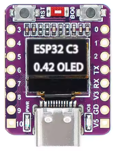

# WLED Usermod: OLED 72x40 (SSD1306)

A custom WLED usermod designed for the **ESP32-C3 Super Mini** development board featuring an integrated **0.42-inch OLED display** (72x40 pixels).

## 📱 About This Device

This specific board is a compact IoT platform based on the **ESP32-C3FN4/FH4** with built-in 4MB Flash, Wi-Fi, and Bluetooth 5.0. It is widely used for teeny-tiny projects like telemetry displays, altitude trackers, or localized status monitors.

*Image source: AlexYeryomin/ESP32C3-OLED-72x40*

### Technical Specifications

* **Controller:** ESP32-C3
* **OLED Resolution:** 72x40 pixels (Effective area)
* **Driver:** SSD1306 (requires 128x64 driver initialization with specific offsets to avoid clipping)
* **I2C Pins:** SDA (GPIO 5), SCL (GPIO 6)
* **Onboard LED:** GPIO 8 (used for heartbeat status)
* **Function Button:** GPIO 9 (normally used for Bootloader mode), assigned to toggling brightness between 0% and current value.

---

## 🛠 Features & Functions

### 1. Adaptive Dashboard

The usermod displays a real-time WLED status dashboard including:

* **Effect Name:** Shows the current WLED mode/effect.
* **Brightness Visualizer:** A horizontal scrolling graph showing brightness (`bri`) levels over time.
* **System Stats:** Quick view of Speed (S), Intensity (I), and Brightness (B) percentages.

### 2. Smart Coordinate Mapping (Flipping Support)

Because this 72x40 display uses a 128x64 driver, normal library rotations can cause the image to "fall off" the physical glass. This usermod includes **Dynamic Offset Calculation**:

* **Normal Mode:** Centers the 72x40 UI in the top-left area.
* **Flipped Mode:** Automatically shifts coordinates to the bottom-right of the 128x64 memory buffer so the UI remains perfectly centered and visible when rotated 180°.

### 3. LED Heartbeat & Network Status

The onboard **GPIO 8** LED provides visual feedback of the device's connectivity:

* **Blinking:** The device is disconnected from the network.
* **Pulsing (Sinusoidal):** The device is successfully connected to WiFi.

### 4. Splash Screen & Info

Upon boot, the display shows the **Akemi Logo** and current **mDNS name or IP Address** for 5 seconds to help you locate the device on your network.

### 5. Configurable Sleep Timer

To prevent OLED burn-in, the screen automatically blanks after a period of inactivity (default: 60 seconds). It wakes up instantly when:

* The physical button is pressed.
* Settings are changed via the WLED Web UI or API.

---

## ⚙️ Configuration

The following settings are available directly in the **WLED Usermod Settings** page (v0.15.3+):

* **Enabled:** Toggle the OLED on/off.
* **Flip Display:** Rotates the UI 180° and adjusts internal offsets.
* **X/Y-Offset:** Fine-tune the UI position on your specific glass.
* **Sleep Timeout:** Set how many seconds to wait before the screen turns off.

## 🔗 References & Inspiration

* [AlexYeryomin/ESP32C3-OLED-72x40](https://github.com/AlexYeryomin/ESP32C3-OLED-72x40) - Driver implementation and original Micropython demo.
* [Kevin's Blog: ESP32-C3 0.42 OLED](https://emalliab.wordpress.com/2025/02/12/esp32-c3-0-42-oled/) - Deep dive into coordinate offsets and hardware constraints.