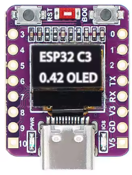

# WLED Usermod: OLED 72x40 (SSD1306)

A custom WLED usermod designed for the **ESP32-C3 Super Mini** development board featuring an integrated **0.42-inch OLED display** (72x40 pixels).

## About This Device

This specific board is a compact IoT platform based on the **ESP32-C3FN4/FH4** with built-in 4MB Flash, Wi-Fi, and Bluetooth 5.0. It is widely used for teeny-tiny projects like telemetry displays, altitude trackers, or localized status monitors.


*Image source: AlexYeryomin/ESP32C3-OLED-72x40*

### Technical Specifications

* **Controller:** ESP32-C3
* **OLED Resolution:** 72x40 pixels (Effective area)
* **Driver:** SSD1306 (requires 128x64 driver initialization with specific offsets to avoid clipping)
* **I2C Pins:** Must be configured in WLED's **Config > LED Preferences > Hardware I2C** settings (typically SDA=5, SCL=6 for this board)
* **Onboard LED:** GPIO 8 (used for heartbeat status, configurable)
* **Function Button:** GPIO 9 - configure in WLED's **Config > LED Preferences > Button** settings as a push button

---

## Features & Functions

### 1. Adaptive Dashboard

The usermod displays a real-time WLED status dashboard including:

* **Effect Name:** Shows the current WLED mode/effect.
* **Brightness Visualizer:** A horizontal scrolling graph showing brightness (`bri`) levels over time.
* **System Stats:** Quick view of Speed (S), Intensity (I), and Brightness (B) percentages.

### 2. Smart Coordinate Mapping (Flipping Support)

Because this 72x40 display uses a 128x64 driver, normal library rotations can cause the image to "fall off" the physical glass. This usermod includes **Dynamic Offset Calculation**:

* **Normal Mode:** Centers the 72x40 UI in the top-left area.
* **Flipped Mode:** Automatically shifts coordinates to the bottom-right of the 128x64 memory buffer so the UI remains perfectly centered and visible when rotated 180 degrees.

### 3. LED Heartbeat & Network Status

The onboard LED (default GPIO 8) provides visual feedback of the device's connectivity:

* **Blinking:** The device is disconnected from the network.
* **Pulsing (Sinusoidal):** The device is successfully connected to WiFi.

Set `ledPin` to `-1` in the usermod settings to disable the heartbeat LED.

### 4. Splash Screen & Info

Upon boot, the display shows the **Akemi Logo** and current **mDNS name or IP Address** for 5 seconds (non-blocking) to help you locate the device on your network.

### 5. Configurable Sleep Timer

To prevent OLED burn-in, the screen automatically blanks after a period of inactivity (default: 60 seconds). It wakes up instantly when:

* A button press is detected (on the configured button index).
* Settings are changed via the WLED Web UI or API.

---

## Configuration

The following settings are available directly in the **WLED Usermod Settings** page:

* **Enabled:** Toggle the OLED on/off.
* **Flip Display:** Rotates the UI 180 degrees and adjusts internal offsets.
* **X/Y-Offset:** Fine-tune the UI position on your specific glass (in pixels).
* **Sleep Timeout:** Set how many seconds to wait before the screen turns off (0 = never).
* **Button Index:** Which WLED button index this usermod responds to (configure the physical button pin in WLED's button settings).
* **LED Pin:** GPIO pin for the heartbeat LED (-1 to disable).

---

## Build Setup

### platformio_override.ini

Create a `platformio_override.ini` file in the project root with the following content:

```ini
[env:esp32c3dev_oled72x40]
extends = env:esp32c3dev
build_flags = ${env:esp32c3dev.build_flags}
  -D I2CSDAPIN=5          ; OLED I2C SDA pin
  -D I2CSCLPIN=6          ; OLED I2C SCL pin
  -D DATA_PINS=10         ; LED strip data output pin
  -D BTNPIN=9             ; Onboard boot button used as pushbutton
  -D BTNTYPE=BTN_TYPE_PUSH
custom_usermods = OLED_72x40
```

Then build with:
```bash
pio run -e esp32c3dev_oled72x40
```

### Build Flags Reference

| Flag | Default | Description |
|------|---------|-------------|
| `-D I2CSDAPIN=5` | -1 (disabled) | I2C SDA pin for the OLED display |
| `-D I2CSCLPIN=6` | -1 (disabled) | I2C SCL pin for the OLED display |
| `-D DATA_PINS=10` | 2 (ESP32-C3) | GPIO for the LED strip data output |
| `-D BTNPIN=9` | 0 | GPIO for the onboard pushbutton |
| `-D BTNTYPE=BTN_TYPE_PUSH` | BTN_TYPE_PUSH | Button type (push is the default) |
| `-D LOLIN_WIFI_FIX` | (already enabled for esp32c3dev) | Reduces WiFi TX power to fix connectivity issues on some boards |

### WiFi TX Power Fix

The `esp32c3dev` environment already includes `-DLOLIN_WIFI_FIX` by default. If you experience WiFi connectivity issues with a custom environment, make sure this flag is present in your build flags. This is a known issue with some ESP32-C3 boards. See: https://www.youtube.com/watch?v=UHTdhCrSA3g

---

## References & Inspiration

* [AlexYeryomin/ESP32C3-OLED-72x40](https://github.com/AlexYeryomin/ESP32C3-OLED-72x40) - Driver implementation and original Micropython demo.
* [Kevin's Blog: ESP32-C3 0.42 OLED](https://emalliab.wordpress.com/2025/02/12/esp32-c3-0-42-oled/) - Deep dive into coordinate offsets and hardware constraints.
* [Pixel Matrix Studio](https://doccaz.github.io/pixel-matrix-studio/) - Tool used to create the Akemi boot splash bitmap.
