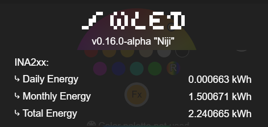
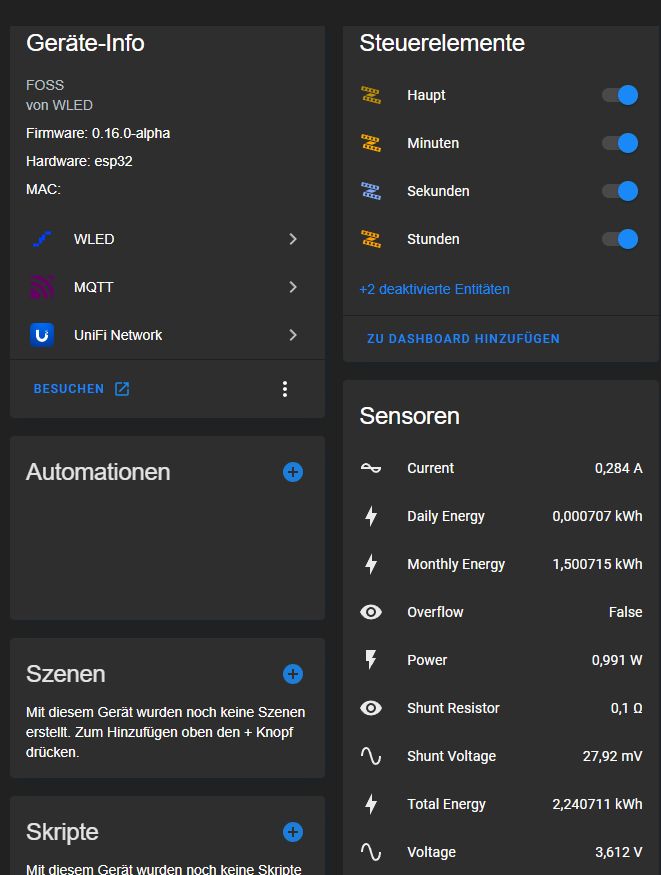
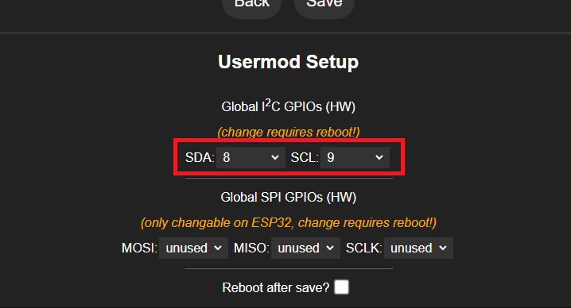
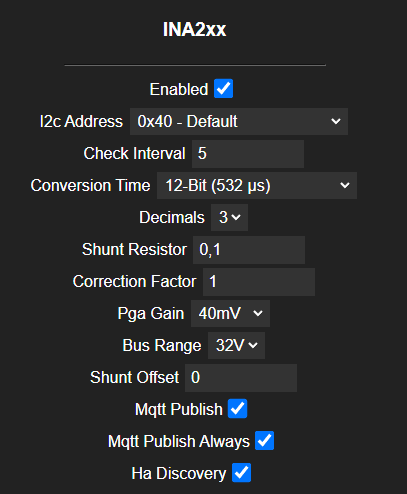
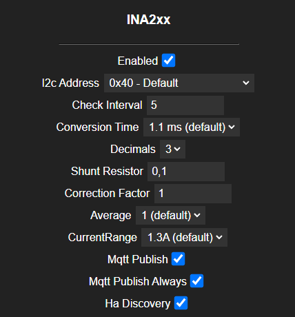
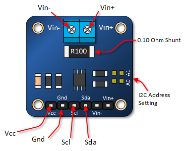
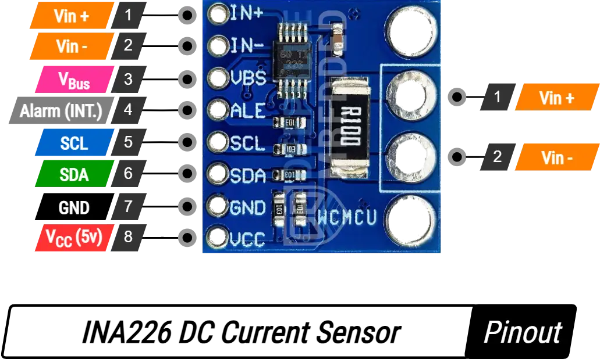

# INA2XX WLED Usermod

This Usermod integrates the INA219 **and** INA226 sensors with WLED to monitor energy consumption. It can read voltage, current, power, and calculate daily, monthly and total energy usage for either sensor.

## Features

- Monitors bus voltage, shunt voltage, current, and power (both INA219 & INA226).
- Calculates total energy consumed in kilowatt-hours (kWh).
- Calculates daily and monthly energy usage (resets after 24 h and 30 days respectively).  
- Supports MQTT publishing of sensor data.
- Publishes energy data to Home Assistant directly to the WLED entity for easy integration.
- Displays daily, monthly and total energy used in the WLED GUI under the info section.
- Configurable through WLED's web interface or `my_config.h`.

## Screenshots


### Info, Home Assistant and Pin Selection under Usermod

| Info screen                                    | Home Assistant                                               | Usermod Settings page - Pin Selection												  |
|------------------------------------------------|--------------------------------------------------------------|-------------------------------------------------------------------------------------|
|    |   |          |

### Settings - Usermod

| Settings page - Usermod INA219                                      |  Settings page - Usermod INA226                                     |
|---------------------------------------------------------------------|---------------------------------------------------------------------|
|  |  |

---

## Configuration Parameters

> **Note:** Before using, you **must** define the sensor type in your `my_config.h` or via PlatformIO build flags:  
> ```cpp
> #define INA_SENSOR_TYPE 219   // or 226
> ```

### Universal Parameters

| Parameter                     | Description                                                | Default Value  | Possible Values                                        |
|-------------------------------|------------------------------------------------------------|----------------|--------------------------------------------------------|
| `INA2XX_ENABLED`              | Enable or disable the INA2XX Usermod                       | `false`        | `true`, `false`                                        |
| `INA2XX_I2C_ADDRESS`          | I2C address of the INA2XX sensor                           | `0x40`         | See options below for available addresses.             |
| `INA2XX_CHECK_INTERVAL`       | Interval for checking sensor values (seconds)              | `5`            | Any positive integer                                   |
| `INA2XX_CONVERSION_TIME`      | ADC conversion time                                        | `BIT_MODE_12` (219)<br>`CONV_TIME_1100` (226) | Sensor-specific (see below)                |
| `INA2XX_DECIMAL_FACTOR`       | Number of decimal places for current and power readings    | `3`            | See options below for decimal places.                  |
| `INA2XX_SHUNT_RESISTOR`       | Value of the shunt resistor in ohms                        | `0.1`          | Any positive float value matching your INA2XX resistor |
| `INA2XX_CORRECTION_FACTOR`    | Correction factor for measurements                         | `1.0`          | Any positive float value                               |
| `INA2XX_MQTT_PUBLISH`         | Publish sensor data to MQTT                                | `false`        | `true`, `false`                                        |
| `INA2XX_MQTT_PUBLISH_ALWAYS`  | Always publish values, regardless of change                | `false`        | `true`, `false`                                        |
| `INA2XX_HA_DISCOVERY`         | Enable Home Assistant discovery for sensors                | `false`        | `true`, `false`                                        |

### INA219-Specific Parameters (`INA_SENSOR_TYPE == 219`)

| Parameter                     | Description                                                | Default       | Possible Values                                        |
|-------------------------------|------------------------------------------------------------|---------------|--------------------------------------------------------|
| `INA2XX_BUSRANGE`             | Bus voltage range                                          | `BRNG_32`     | `BRNG_16`, `BRNG_32`                                   |
| `INA2XX_P_GAIN`               | Shunt voltage gain                                         | `PG_320`      | `PG_40`, `PG_80`, `PG_160`, `PG_320`                   |
| `INA2XX_SHUNT_VOLT_OFFSET`    | Millivolt offset at zero current                           | `0.0`         | Any float (mV)                                         |

#### Options for `INA2XX_CONVERSION_TIME` (INA219)

| Value             | Description                |
|-------------------|----------------------------|
| `BIT_MODE_9`      | 9-Bit (84 µs)              |
| `BIT_MODE_10`     | 10-Bit (148 µs)            |
| `BIT_MODE_11`     | 11-Bit (276 µs)            |
| `BIT_MODE_12`     | 12-Bit (532 µs)            |
| `SAMPLE_MODE_2`   | 2 samples (1.06 ms)        |
| `SAMPLE_MODE_4`   | 4 samples (2.13 ms)        |
| `SAMPLE_MODE_8`   | 8 samples (4.26 ms)        |
| `SAMPLE_MODE_16`  | 16 samples (8.51 ms)       |
| `SAMPLE_MODE_32`  | 32 samples (17.02 ms)      |
| `SAMPLE_MODE_64`  | 64 samples (34.05 ms)      |
| `SAMPLE_MODE_128` | 128 samples (68.10 ms)     |

### INA226-Specific Parameters (`INA_SENSOR_TYPE == 226`)

| Parameter                     | Description                                                | Default       | Possible Values                      |
|-------------------------------|------------------------------------------------------------|---------------|--------------------------------------|
| `INA2XX_AVERAGES`             | Number of averaging samples                                | `AVERAGE_1`   | `AVERAGE_1`, `AVERAGE_4`, `AVERAGE_16`, … |
| `INA2XX_RANGE`                | Current measurement range (max in A)                       | `1.3`         | Up to `10.0`                         |

#### Options for `INA2XX_CONVERSION_TIME` (INA226)

| Value             | Conversion Time              |
|-------------------|------------------------------|
| `CONV_TIME_140`   | 140 µs                       |
| `CONV_TIME_204`   | 204 µs                       |
| `CONV_TIME_556`   | 556 µs                       |
| `CONV_TIME_1100`  | 1.100 ms                     |
| `CONV_TIME_2116`  | 2.116 ms                     |
| `CONV_TIME_4156`  | 4.156 ms                     |
| `CONV_TIME_8244`  | 8.244 ms                     |


### Options for `INA2XX_DECIMAL_FACTOR`

The `decimalFactor` parameter can be set to:

| Decimal Places | Value | Example         |
|----------------|-------|------------------|
| 0              | 0     | 100              |
| 1              | 1     | 100.0            |
| 2              | 2     | 100.00           |
| 3              | 3     | 100.000          |

### Options for `INA2XX_I2C_ADDRESS`

The `i2cAddress` parameter can be set to the following options:

| Address             | Description                        | Value   |
|---------------------|------------------------------------|---------|
| `0x40`              | 0x40 - Default                     | 0x40    |
| `0x41`              | 0x41 - A0 soldered                 | 0x41    |
| `0x44`              | 0x44 - A1 soldered                 | 0x44    |
| `0x45`              | 0x45 - A0 and A1 soldered          | 0x45    |

---

# Compiling

To enable, add `INA2XX_v2` to your `custom_usermods`  (e.g. in `platformio_override.ini`)
```ini
[env:usermod_ina2xx_d1_mini]
extends = env:d1_mini
custom_usermods = ${env:d1_mini.custom_usermods} INA2XX_v2
```

## Usage

1. Define your sensor in my_config.h or via build flags:

```cpp
#define INA_SENSOR_TYPE 219   // or 226
```

2. Setup SDA/SCL Pin - see at the readme bottom → ### I2C Configuration (Mandatory)

3. Enable the usermod in WLED’s web interface (Settings → Usermod → INA2XX).

4. Configure parameters in the web interface or predefine them in my_config.h:

```cpp
#define INA2XX_ENABLED             false
#define INA2XX_I2C_ADDRESS         0x40
#define INA2XX_CHECK_INTERVAL      5
#define INA2XX_CONVERSION_TIME     BIT_MODE_12      // or CONV_TIME_1100
#define INA2XX_DECIMAL_FACTOR      3
#define INA2XX_SHUNT_RESISTOR      0.1
#define INA2XX_CORRECTION_FACTOR   1.0
#define INA2XX_BUSRANGE            BRNG_32          // INA219 only
#define INA2XX_P_GAIN              PG_320           // INA219 only
#define INA2XX_SHUNT_VOLT_OFFSET   0.0              // INA219 only
#define INA2XX_AVERAGES            AVERAGE_1        // INA226 only
#define INA2XX_RANGE               1.3              // INA226 only
#define INA2XX_MQTT_PUBLISH        false
#define INA2XX_MQTT_PUBLISH_ALWAYS false
#define INA2XX_HA_DISCOVERY        false
```

5. Monitor your energy consumption through the WLED interface or via MQTT.

## Energy Calculation

- **Total Energy** is calculated continuously.
- **Daily Energy** resets after 24 hours.
- **Monthly Energy** resets after 30 days.

To reset daily or monthly energy calculations, you can implement corresponding functions within your main application.

### I2C Configuration (Mandatory)
The INA2XX sensor communicates via I2C, so the SDA and SCL pins must be correctly set before enabling the usermod.

1. Open the **WLED Web Interface**.
2. Go to **Settings → Usermod → Global I2C GPIOs (HW)**.
3. Select the appropriate **SDA** and **SCL** pins for your hardware.
4. Save the settings and **reboot WLED**.

🚀 **After rebooting, you can enable the **INA2xx** usermod in the settings.**


### INA226 Wiring Tip

- Measuring bus voltage: Tie the INA226’s VIN– pin directly to the VBUS line (load side). This ensures the sensor reads the full voltage drop across your bus.

### Sensor Pinouts

The following diagrams show the typical I2C pin configurations for both INA219 and INA226 modules.

| INA219 Pinout                                       | INA226 Pinout                                       |
|-----------------------------------------------------|-----------------------------------------------------|
|          |          |
