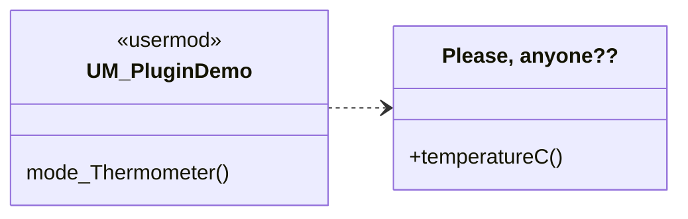
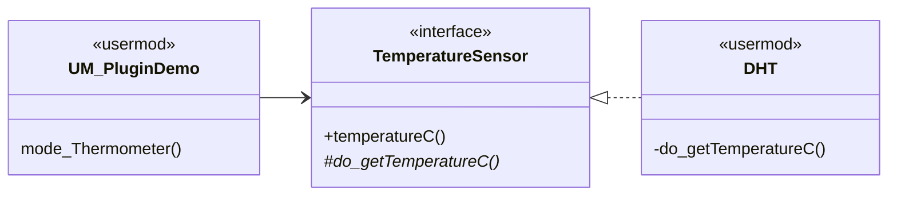
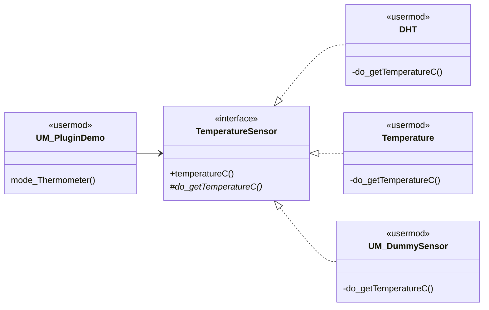
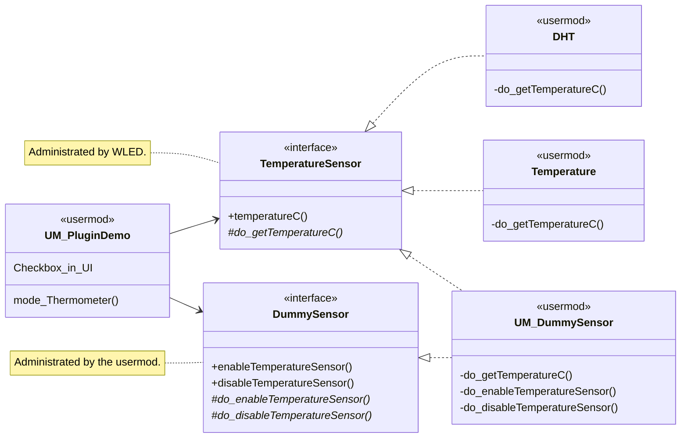

# A Plugin Framework for WLED's Usermods.

**TL;DR** <br>
These interfaces here are very high-level by explicit design choice - and they are administrated
by the WLED framework only. <br>
This directory here is **not** the place for specialized custom interfaces - use the subdirectory
`custom` for that. <br>
Have a look at the examples and the comments in the sourcefiles for inspiration for your own
usermods.


## Upgrading Usermods to Plugins

Read the design description below, follow the examples in the usermods `UM_PluginDemo` and
`UM_DummySensor`, and have a look at the comments in the sourcefiles inside this directory.


# Design Description

## Administrated Plugin APIs

These interfaces are administrated by WLED, which means that they shall remain very stable and
generic. All usermods can rely on the assumption that these won't change (at least not a lot and not
breaking). The `PluginManager` inside WLED is aware of all instances of these interfaces, and will
establish the connections between all users and providers of them.

### The Problem

A usermod contains an effect, which wants to render the current temperature in °C as a bar on the
LED strip. Therefore it needs a temperature sensor that it can ask for the actual value:



### The Solution

WLED defines an interface, which is designated for providing current temperature readings. Our
desperate usermod is now happy and can draw whatever it feels to, based on the data from the
sensor. <br>
However, another usermod will also be needed, which implements that interface. It contains the
actual magic of reading meaningful data from a small piece of hardware. <br>
Enter: The `DHT` usermod:



### More Solutions

Since there exist more real temperature sensors than the `DHT` usermod can handle, there are other
usermods for other hardware. And even a `DummySensor`, which just simulates temperature readings. <br>
Regardless of which one of those other usermodes is compiled into WLED, our little thermometer
effect will always get its desired temperature value. Without actually having to worry about from
whom (because the `PluginManager` takes care of that):




## Custom Plugin APIs

Our `DummySensor` can offer more functionality through a custom interface, which is is defined by the
usermod itself (and not by WLED, in contrast to the administrated interfaces from before). Through
that custom interface, it can offer any kind of functionality (whether it makes sense for anyone
else or not). In our example, its simulated TemperatureSensor can be enabled and disabled. <br>
Just out of fun, our thermometer effect forwards the state of a checkbox in the UI to those methods.
This really doesn't make any sense, but it shows nicely how a custom plugin API is working.



To make things complete, the thermometer effect can easily detect if WLED has been compiled with or
without the `DummySensor` usermod. In case the dummy is missing, it will just ignore the checkbox.


## GPIO Pin Handling for Plugins

Usermods can aquire their desired GPIO pins through the `PluginManager`. For an example, have a
look at the `UM_PluginDemo` usermod. <br>
In a nutshell, the procedure is as follows:
- Usermods that want to use GPIO pins must have `PinUser` as a base class.
- They specify their wanted pins through an instance (or array) of `PinConfig` member variable.
  - This contains the desired pin number, pin functionality, and optionally a name for the pin.
- During `setup()`, they register this configuration at the `PluginManager`.
- The `PluginManager` forwards the request to WLED's `PinManager` and returns its result.

There's no more a need for defining dedicated `PinManager` constants for every usermod inside
`pin_manager.h`. All registrations are done in the name of the `PluginManager` (as a proxy), who
internally keeps track of all its registered `PinUser`s.


# Appendix

## Custom Builds with Usermods

For everyone who is frequently forgetting how to enable usermods for custom WLED builds (like me):
Here's your friendly reminder!

Create a file `platformio_override.ini` in the root directory, and paste the following code into
that file. Probably you have to restart VS Code to make that new entry appear in the PlatformIO
Project Environment selection list of the statusbar.

```ini
[env:Custom_UM]
extends = env:esp32c3dev
custom_usermods = UM_PluginDemo UM_DummySensor
```

This example is for an **ESP32-C3**. Replace `env:esp32c3dev` with one of these common controllers:
- `env:esp32dev` = The good old ESP32
- `env:esp8266_2m` = Generic ESP8266
- `env:esp01_1m_full` = ESP-01

And don't forget to have a look into `platformio_override.sample.ini` and
`platformio.ini` for much more inspiration!


## Ideas for potential future APIs

- `BatterySensor` with `uint16_t batteryLevel()`, with range 0 ... 1000 representing 0.0 ... 100.0%
  (or just `float` as for the other APIs)
- `TimeProvider` with `getTime()`, returning a struct of `year/month/day` & `hour/minute/second`
  - Localtime; without DST and timezone.
  - With usermod implementations, based on I2C or OneWire RTC or NTP or DCF77 or ...
- `AudioSensor` with ...
  - ... be careful to stay generic with these interfaces!
- `UiClient_PowerButton` for a generic handling of all usermod's powerbuttons in the info-page of the UI.
  - Thus a lot of repeated boilerplate code from many usermods could be consolidated inside PluginManager.
- `UiClient_InfoSection` with a more comfortable API for adding entries to the info-page of the UI.
  - Also enables consolidation of repeated boilerplate code from the usermods.
- `ButtonUser` with `void onButtonPressed()`, for plugins that need an external trigger from a pushbutton.
  - WLED somehow integrates these into its exising button management, as it already does for macros
    in the UI configuration under "Button actions".
  - So the plugin doesn't have to deal with raw GPIO pins when it just needs a simple trigger.
- MQTT publisher / subscriber
- audioreactive (since this can practically be considered as an essential part of WLED)
  - `under construction`
- ... ?
